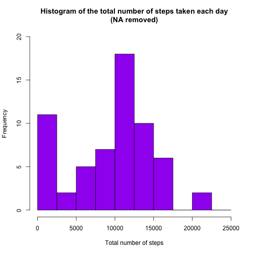
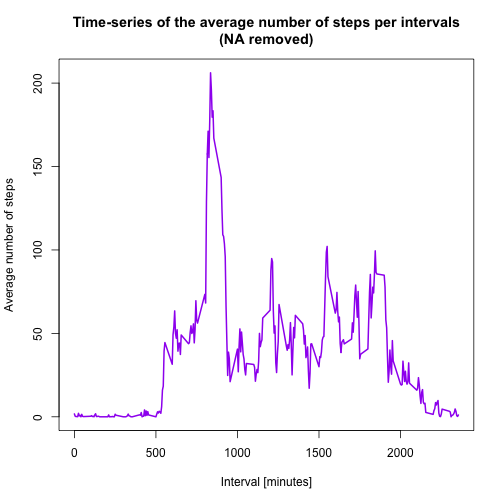
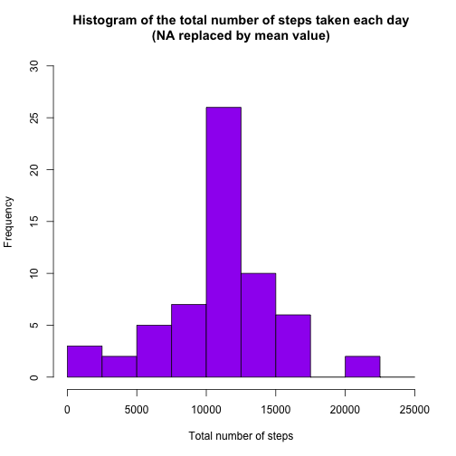
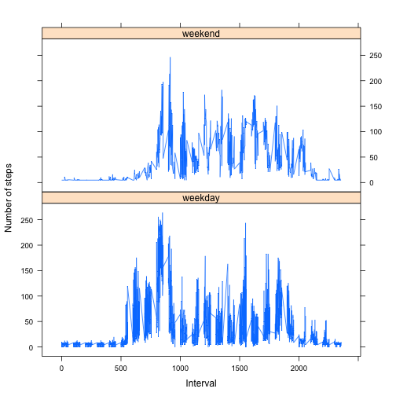

### Loading and preprocessing the data

```r
 activity <- read.csv("activity.csv")
 activitydays <- tapply(activity$steps, activity$date, sum, na.rm=TRUE)
```
Compute the total number of steps each day (NA values removed)

```r
      sum_data <- aggregate(activity$steps, by=list(activity$date), FUN=sum, na.rm=TRUE)
 #Rename the attributes
    names(sum_data) <- c("date", "total")
```
Compute the histogram of the total number of steps each day  

```r
  hist(sum_data$total, 
      breaks=seq(from=0, to=25000, by=2500),
       col="purple", 
       xlab="Total number of steps", 
       ylim=c(0, 20), 
       main="Histogram of the total number of steps taken each day\n(NA removed)") 
```

 

### What is mean total number of steps taken per day?  

```r
  mean(sum_data$total)
```

```
## [1] 9354.23
```

```r
  median(sum_data$total)
```

```
## [1] 10395
```
mean is 9354.23
median is 10395

### What is the average daily activity pattern?  

```r
  # Clear the workspace
  rm(sum_data)
  
  # Compute the means of steps accross all days for each interval
  mean_data <- aggregate(activity$steps, 
      by=list(activity$interval), FUN=mean, na.rm=TRUE)
  
  # Rename the attributes
  names(mean_data) <- c("interval", "mean")
```
Compute the time series plot    

```r
  plot(mean_data$interval, 
       mean_data$mean, 
       type="l", 
       col="purple", 
       lwd=2, 
       xlab="Interval [minutes]", 
       ylab="Average number of steps", 
       main="Time-series of the average number of steps per intervals\n(NA removed)")
```

 

Find the max interval

```r
  #Find the position of the maximum mean
  max_pos <- which(mean_data$mean == max(mean_data$mean))
 
   #look up the value interval at this position
  max_interval <- mean_data[max_pos, 1]
```


```r
  # Clear the workspace
  rm(max_pos, mean_data)
```
The max interval is 835 

### Imputing missing values
1. Calculate and report the total number of missing values in the dataset (i.e. the total number of rows with NA’s)

```r
  # Clear the workspace
  rm(max_interval)
  # We use the trick that a TRUE boolean value is equivalent to 1 and a FALSE to 0.
  NA_count <- sum(is.na(activity$steps))
```
The number of NA’s is 2304.

2.Devise a strategy for filling in all of the missing values in the dataset. The strategy does not need to be sophisticated. For example, you could use the mean/median for that day, or the mean for that 5-minute interval, etc.

```r
  # Clear the workspace
  rm(NA_count)
  
  # Find the NA positions
  na_pos <- which(is.na(activity$steps))
  
  # Create a vector of means
  mean_vec <- rep(mean(activity$steps, na.rm=TRUE), times=length(na_pos))
```
Replaced each NA value by the mean of the steps 

3.Create a new dataset that is equal to the original dataset but with the missing data filled in.

```r
  # Replace the NAs by the means
  activity[na_pos, "steps"] <- mean_vec
```


```r
  # Clear the workspace
  rm(mean_vec, na_pos)
```
4. Make a histogram of the total number of steps taken each day and calculate and report the mean and median total number of steps taken per day. Do these values differ from the estimates from the first part of the assignment? What is the impact of imputing missing data on the estimates of the total daily number of steps?

```r
    # Compute the total number of steps each day (NA values removed)
    sum_data <- aggregate(activity$steps, by=list(activity$date), FUN=sum)
    
    # Rename the attributes
    names(sum_data) <- c("date", "total")
```
 
  Compute the histogram of the total number of steps each day  

```r
    hist(sum_data$total, 
         breaks=seq(from=0, to=25000, by=2500),
         col="purple", 
         xlab="Total number of steps", 
         ylim=c(0, 30), 
         main="Histogram of the total number of steps taken each day\n(NA replaced by mean value)")
```

 

 The mean and median are computed like

```r
  mean(sum_data$total)
```

```
## [1] 10766.19
```

```r
  median(sum_data$total)
```

```
## [1] 10766.19
```
mean is 10766
median is 10766

These values differ greatly from the estimates from the first part of the assignment. With the missing values thereis more data, and thus a bigger mean and median value. 

### Are there differences in activity patterns between weekdays and weekends?
1.Create a new factor variable in the dataset with two levels - “weekdays” and “weekend” indicating whether a given date is a weekday or weekend day. 

```r
  #format the data  
    activity_raw <-activity
    
    # Transform the date attribute to an actual date format
    activity_raw$date <- as.POSIXct(activity_raw$date, format="%Y-%m-%d")
    
    # Compute the weekdays from the date attribute
    activity_raw <- data.frame(date=activity_raw$date, 
                               weekday=tolower(weekdays(activity_raw$date)), 
                               steps=activity_raw$steps, 
                               interval=activity_raw$interval)
    
    # Compute the day type (weekend or weekday)
    activity_raw <- cbind(activity_raw, 
                          daytype=ifelse(activity_raw$weekday == "saturday" | 
                                           activity_raw$weekday == "sunday", "weekend","weekday"))
    
    # Create the final data.frame
    activity <- data.frame(date=activity_raw$date, 
                           weekday=activity_raw$weekday, 
                           daytype=activity_raw$daytype, 
                           interval=activity_raw$interval,
                           steps=activity_raw$steps)
```
2. Make a panel plot containing a time series plot (i.e. type = "l") of the 5- minute interval (x-axis) and the average number of steps taken, averaged across all weekday days or weekend days (y-axis).  

```r
    # Clear the workspace
    rm(sum_data)
    
    # Load the lattice graphical library
    library(lattice)
    
    # Compute the average number of steps taken, averaged across all daytype variable
    mean_data <- aggregate(activity$steps, 
                           by=list(activity$daytype, 
                                   activity$weekday, activity$interval), mean)
    
    # Rename the attributes
    names(mean_data) <- c("daytype", "weekday", "interval", "mean")
```

Compute the time series plot  

```r
    xyplot(mean ~ interval | daytype, mean_data, 
           type="l", 
           lwd=1, 
           xlab="Interval", 
           ylab="Number of steps", 
           layout=c(1,2))
```

 


```r
# Clear the workspace
rm(mean_data)       
```

